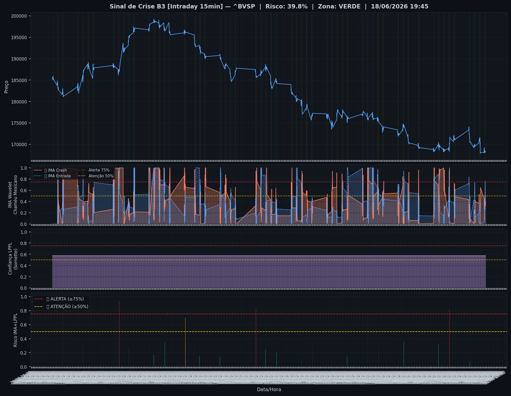
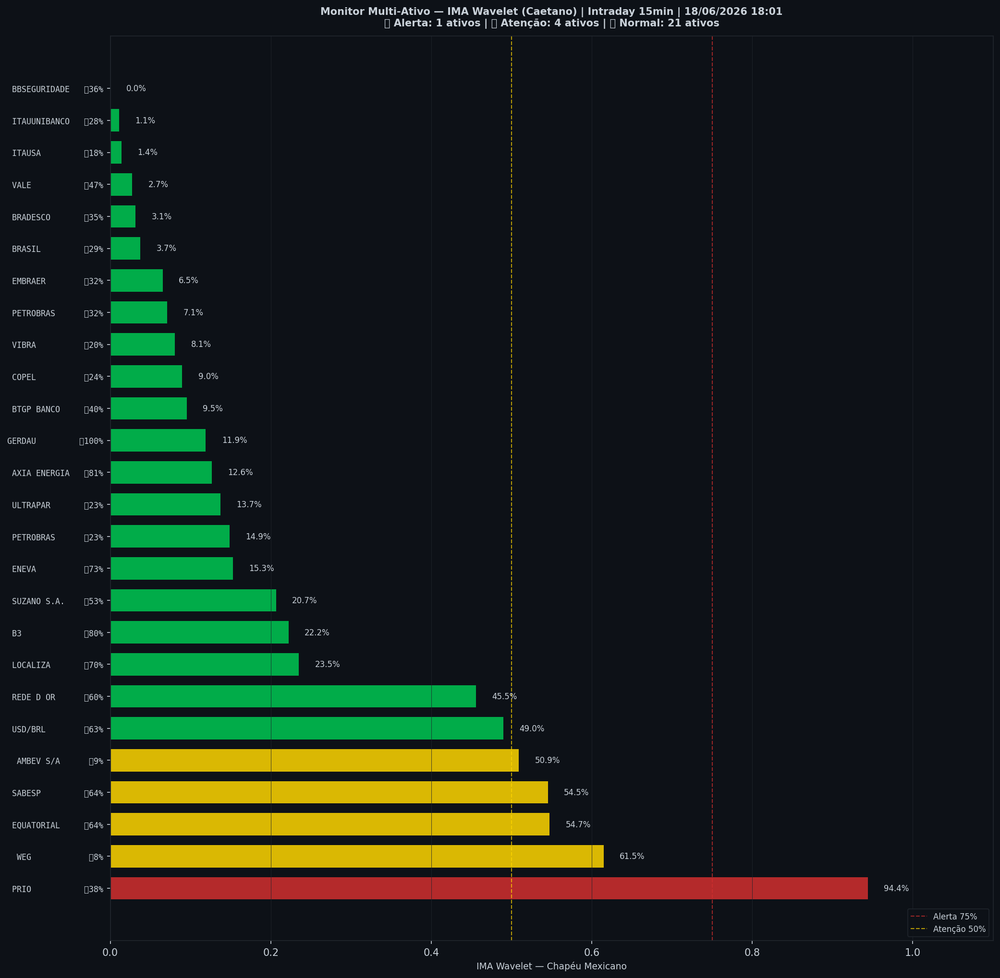

# 🟢 Intraday — 18/06/2026 18:03

| Indicador | Valor |
|---|---|
| **Zona** | 🟢 **VERDE** |
| **Risco IMA** | **39.8%** |
| 🔴 IMA Crash 15min | 39.8% |
| 💵 USD/BRL IMA Crash | 49.0% 🟢 |
| 💵 USD/BRL IMA Entrada | 62.9% |
| Ativos em tensão | 19% (1🔴 4🟡) |

> *Atualizado às 18:03 BRT — Método IMA Wavelet Chapéu Mexicano (Caetano/ITA)*
