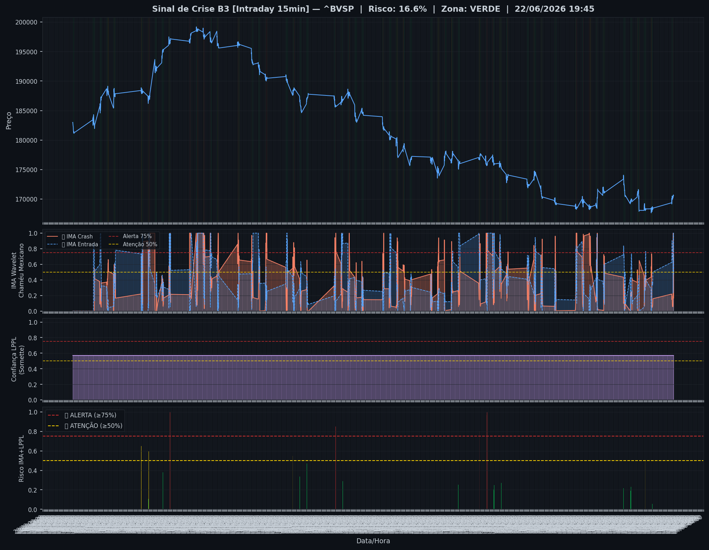
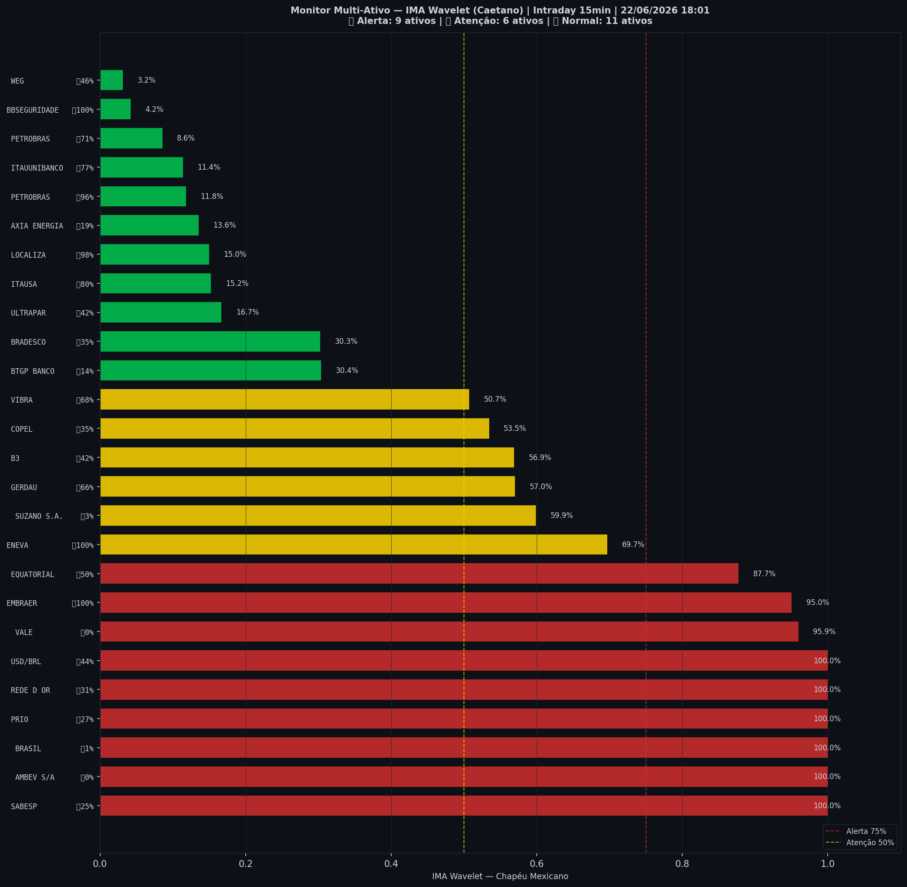

# 🟢 Intraday — 22/06/2026 18:02

| Indicador | Valor |
|---|---|
| **Zona** | 🟢 **VERDE** |
| **Risco IMA** | **16.6%** |
| 🔴 IMA Crash 15min | 16.6% |
| 💵 USD/BRL IMA Crash | 100.0% 🔴 |
| 💵 USD/BRL IMA Entrada | 44.0% |
| Ativos em tensão | 58% (9🔴 6🟡) |

> *Atualizado às 18:02 BRT — Método IMA Wavelet Chapéu Mexicano (Caetano/ITA)*
