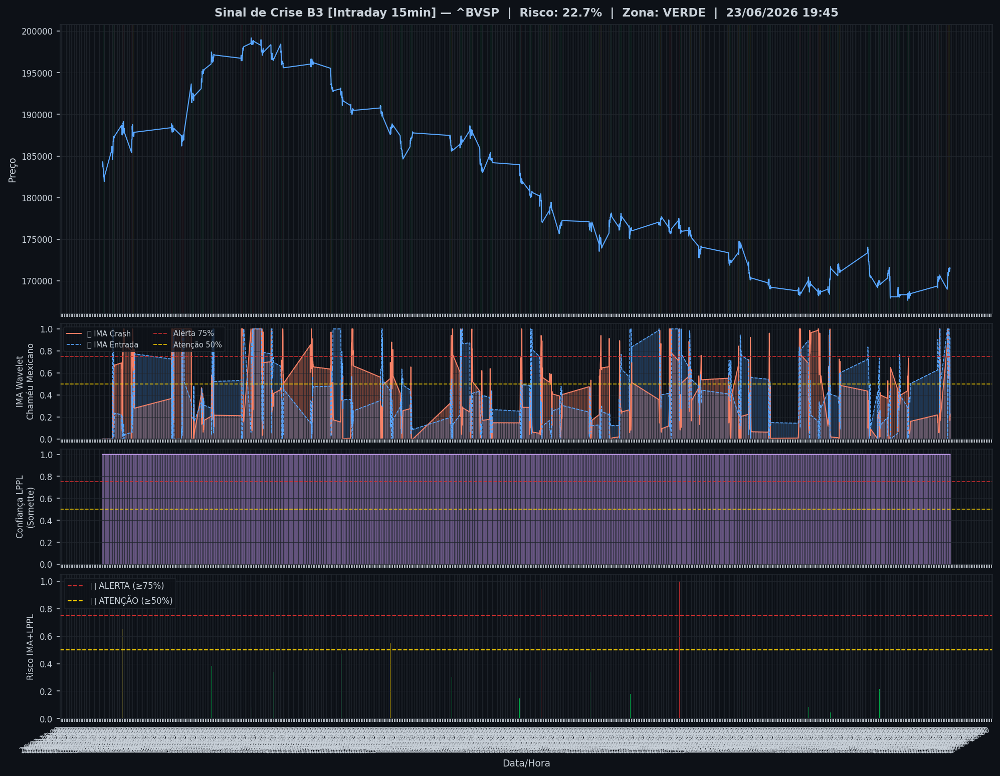
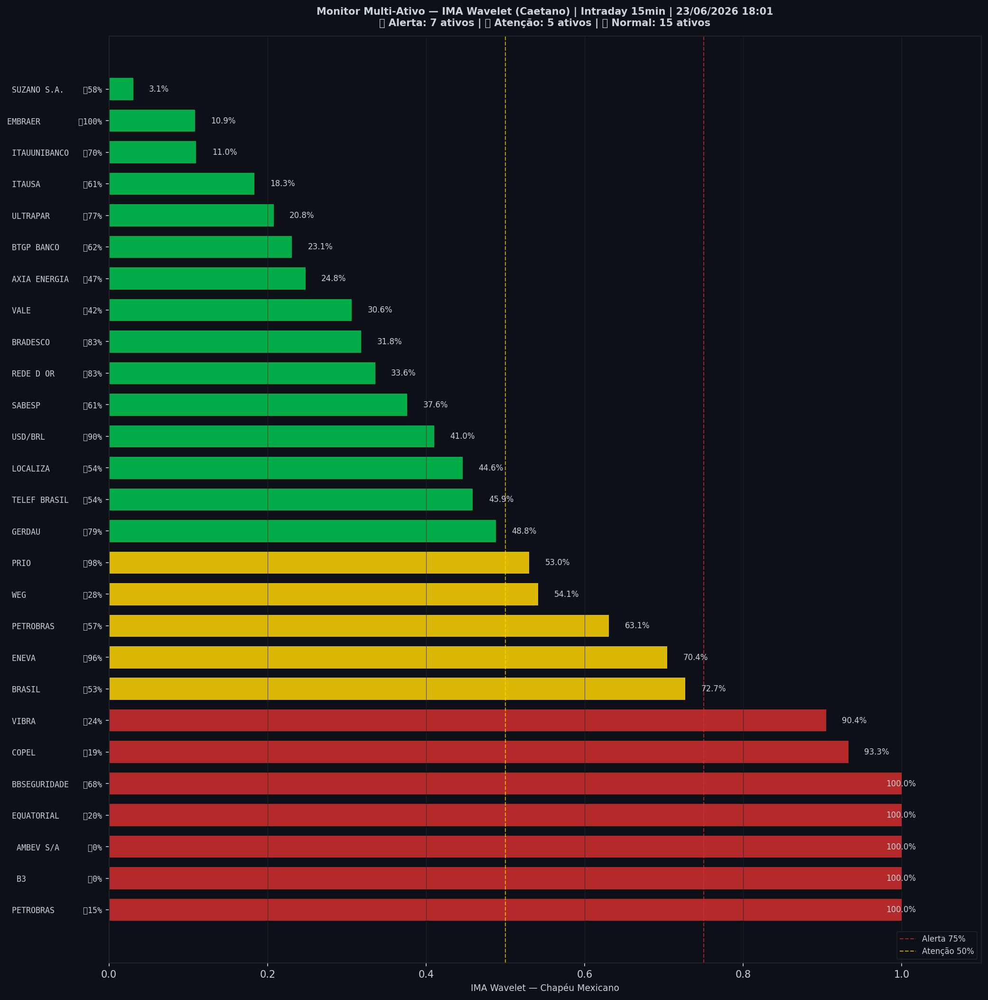

# 🟢 Intraday — 23/06/2026 18:02

| Indicador | Valor |
|---|---|
| **Zona** | 🟢 **VERDE** |
| **Risco IMA** | **22.7%** |
| 🔴 IMA Crash 15min | 22.7% |
| 💵 USD/BRL IMA Crash | 41.0% 🟢 |
| 💵 USD/BRL IMA Entrada | 89.8% |
| Ativos em tensão | 44% (7🔴 5🟡) |

> *Atualizado às 18:02 BRT — Método IMA Wavelet Chapéu Mexicano (Caetano/ITA)*
