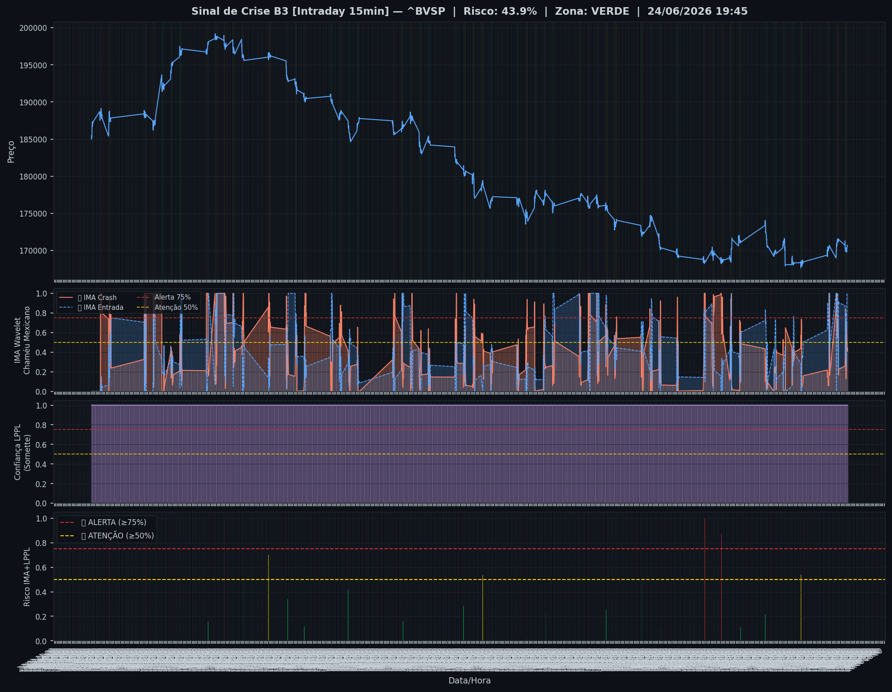
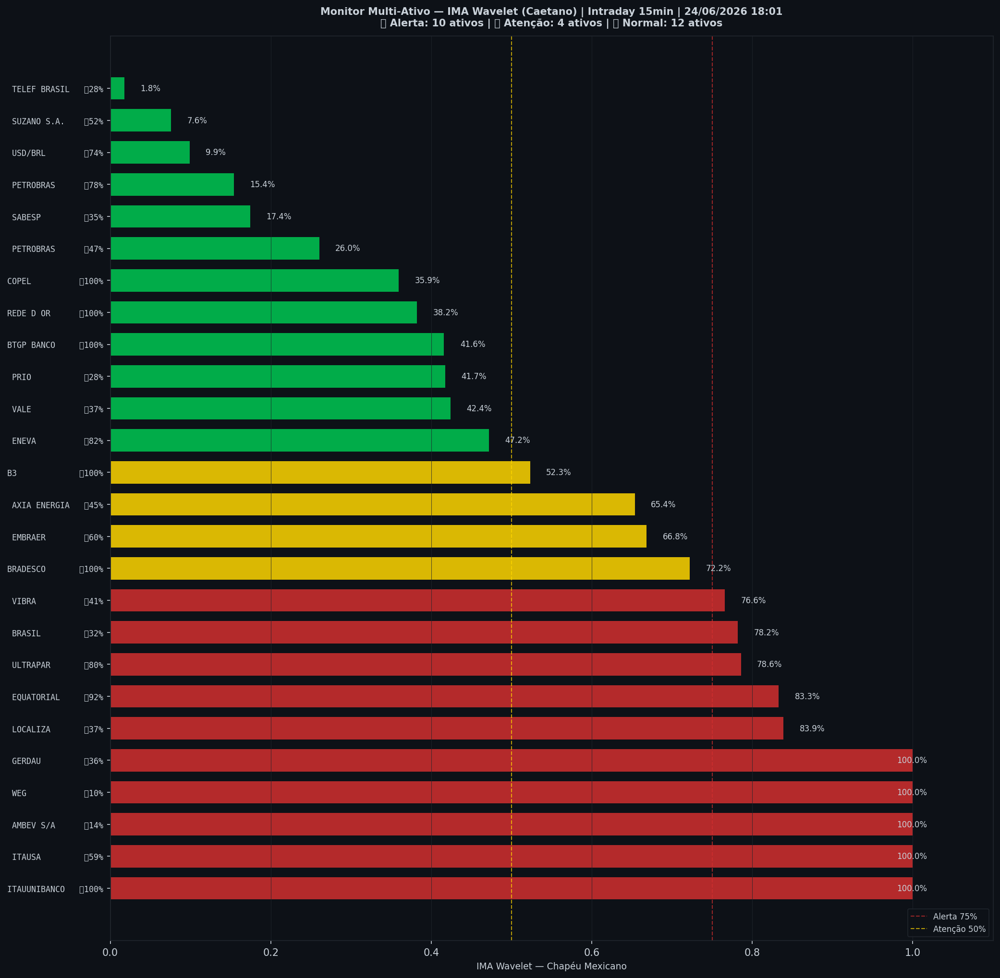

# 🟢 Intraday — 24/06/2026 18:02

| Indicador | Valor |
|---|---|
| **Zona** | 🟢 **VERDE** |
| **Risco IMA** | **43.9%** |
| 🔴 IMA Crash 15min | 43.9% |
| 💵 USD/BRL IMA Crash | 9.9% 🟢 |
| 💵 USD/BRL IMA Entrada | 74.3% |
| Ativos em tensão | 54% (10🔴 4🟡) |

> *Atualizado às 18:02 BRT — Método IMA Wavelet Chapéu Mexicano (Caetano/ITA)*
