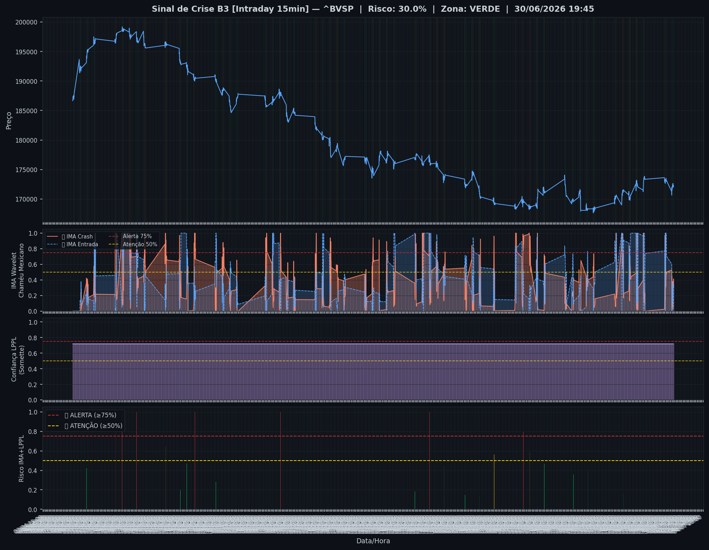
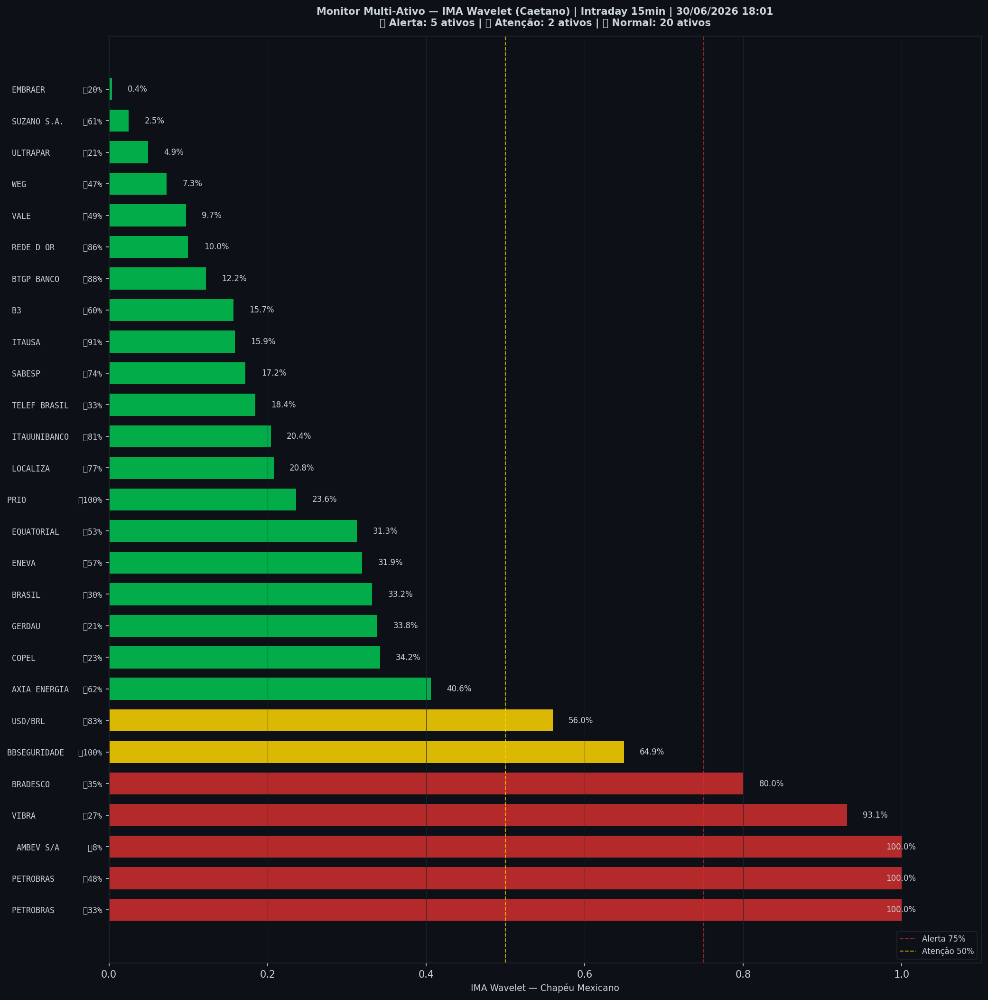

# 🟢 Intraday — 30/06/2026 18:03

| Indicador | Valor |
|---|---|
| **Zona** | 🟢 **VERDE** |
| **Risco IMA** | **29.9%** |
| 🔴 IMA Crash 15min | 29.9% |
| 💵 USD/BRL IMA Crash | 56.0% 🟡 |
| 💵 USD/BRL IMA Entrada | 82.6% |
| Ativos em tensão | 26% (5🔴 2🟡) |

> *Atualizado às 18:03 BRT — Método IMA Wavelet Chapéu Mexicano (Caetano/ITA)*
