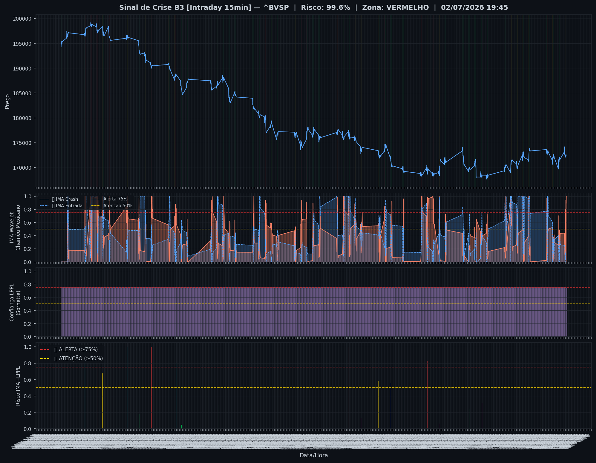
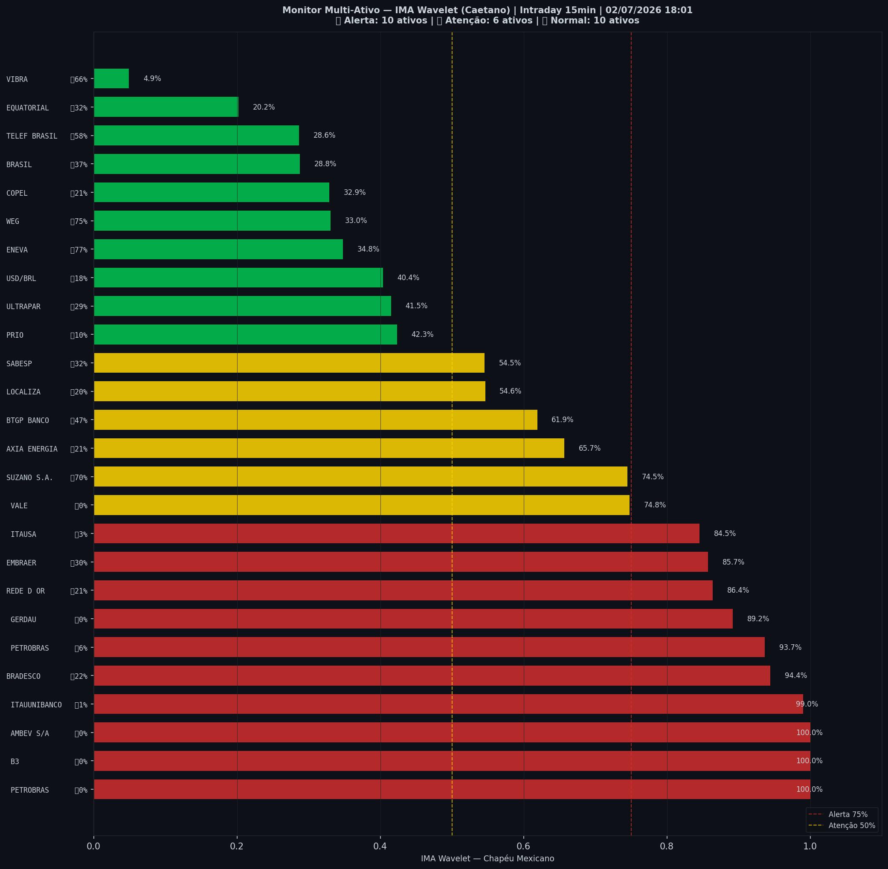

# 🔴 Intraday — 02/07/2026 18:03

| Indicador | Valor |
|---|---|
| **Zona** | 🔴 **VERMELHO** |
| **Risco IMA** | **99.6%** |
| 🔴 IMA Crash 15min | 99.6% |
| 💵 USD/BRL IMA Crash | 40.4% 🟢 |
| 💵 USD/BRL IMA Entrada | 17.8% |
| Ativos em tensão | 62% (10🔴 6🟡) |

> *Atualizado às 18:03 BRT — Método IMA Wavelet Chapéu Mexicano (Caetano/ITA)*
