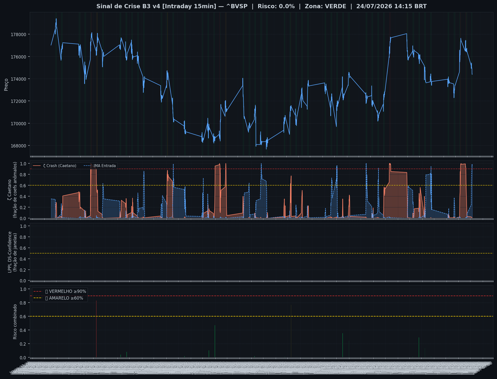
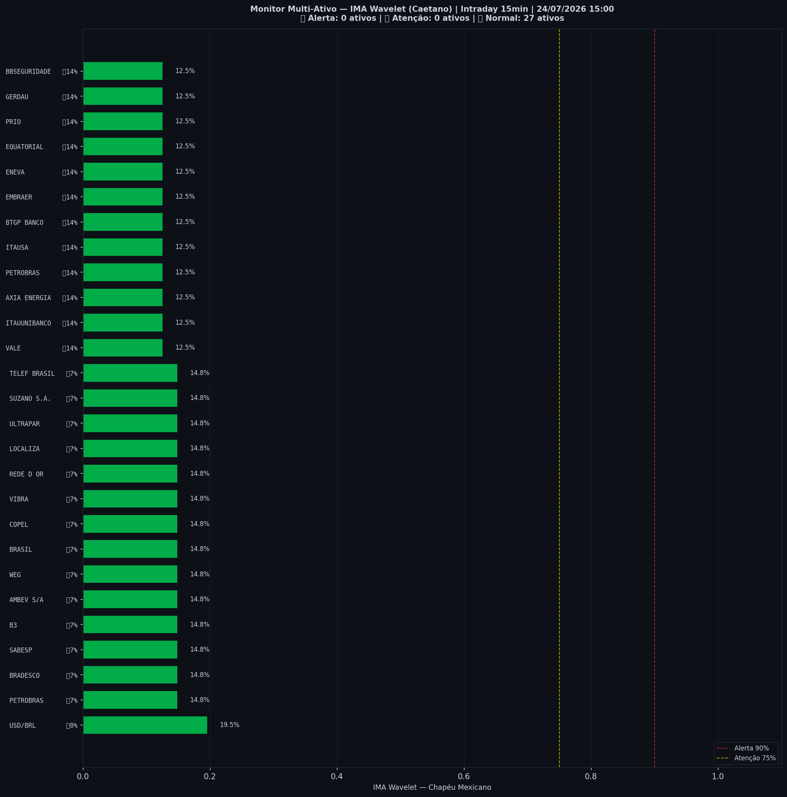

> [!success] 🟢 **VERDE** — Risco 0% · ▼ -1 p.p. vs leitura anterior
> `░░░░░░░░░░░░░░░░░░░░`
> Mercado sem sinais relevantes de estresse.

| Indicador | Valor |
|---|---|
| 🔴 ζ Crash — severidade da queda em curso | **0%** |
| 🔵 ζ Entrada — estrutura de fundo | 98% |
| 🫧 LPPL DS-Confidence | 0% |
| 📊 Ibovespa | 174.415 pts |

## Últimos 30 pregões

| Data | Zona | Risco | IMA Crash | Entrada | LPPL |
|---|---|---|---|---|---|
| 2026-07-24 14:15 | 🟢 VERDE | **0%** | 0% | 98% | 0% |
| 2026-07-24 14:00 | 🟢 VERDE | **1%** | 1% | 98% | 0% |
| 2026-07-24 13:45 | 🟢 VERDE | **1%** | 1% | 96% | 0% |
| 2026-07-24 13:30 | 🟢 VERDE | **0%** | 0% | 97% | 0% |
| 2026-07-24 13:15 | 🟢 VERDE | **0%** | 0% | 96% | 0% |
| 2026-07-24 13:00 | 🟢 VERDE | **0%** | 0% | 97% | 0% |
| 2026-07-24 12:45 | 🟢 VERDE | **0%** | 0% | 98% | 0% |
| 2026-07-24 12:30 | 🟢 VERDE | **0%** | 0% | 95% | 0% |
| 2026-07-24 12:15 | 🟢 VERDE | **0%** | 0% | 91% | 0% |
| 2026-07-24 12:00 | 🟢 VERDE | **1%** | 1% | 86% | 0% |
| 2026-07-24 11:45 | 🟢 VERDE | **1%** | 1% | 81% | 0% |
| 2026-07-24 11:30 | 🟢 VERDE | **0%** | 0% | 77% | 0% |
| 2026-07-24 11:15 | 🟢 VERDE | **0%** | 0% | 74% | 0% |
| 2026-07-24 11:00 | 🟢 VERDE | **0%** | 0% | 70% | 0% |
| 2026-07-24 10:45 | 🟢 VERDE | **0%** | 0% | 65% | 0% |
| 2026-07-24 10:30 | 🟢 VERDE | **1%** | 1% | 59% | 0% |
| 2026-07-24 10:15 | 🟢 VERDE | **2%** | 2% | 38% | 0% |
| 2026-07-24 10:00 | 🟢 VERDE | **2%** | 2% | 24% | 0% |
| 2026-07-23 16:45 | 🟢 VERDE | **3%** | 3% | 8% | 0% |
| 2026-07-23 16:30 | 🟢 VERDE | **5%** | 5% | 2% | 0% |
| 2026-07-23 16:15 | 🟢 VERDE | **10%** | 10% | 2% | 0% |
| 2026-07-23 16:00 | 🟢 VERDE | **13%** | 13% | 0% | 0% |
| 2026-07-23 15:45 | 🟢 VERDE | **19%** | 19% | 1% | 0% |
| 2026-07-23 15:30 | 🟢 VERDE | **21%** | 21% | 2% | 0% |
| 2026-07-23 15:15 | 🟢 VERDE | **25%** | 25% | 2% | 0% |
| 2026-07-23 15:00 | 🟢 VERDE | **30%** | 30% | 2% | 0% |
| 2026-07-23 14:45 | 🟢 VERDE | **32%** | 32% | 1% | 0% |
| 2026-07-23 14:30 | 🟢 VERDE | **35%** | 35% | 0% | 0% |
| 2026-07-23 14:15 | 🟢 VERDE | **40%** | 40% | 0% | 0% |
| 2026-07-23 14:00 | 🟢 VERDE | **43%** | 43% | 0% | 0% |

## Monitor Multi-Ativo

**0% dos ativos em tensão** (0🔴 0🟡) — quanto mais ativos disparam juntos, mais confiável o sinal.

| Zona | Ativo | Setor | IMA Crash | IMA Entrada |
|---|---|---|---|---|
| 🟢 | **USD/BRL** | Câmbio | 19.5% | 0.0% |
| 🟢 | **PETROBRAS** | Petróleo | 14.8% | 7.0% |
| 🟢 | **BRADESCO** | Financeiro | 14.8% | 7.0% |
| 🟢 | **SABESP** | Saneamento | 14.8% | 7.0% |
| 🟢 | **B3** | Financeiro | 14.8% | 7.0% |
| 🟢 | **AMBEV S/A** | Consumo | 14.8% | 7.0% |
| 🟢 | **WEG** | Industrial | 14.8% | 7.0% |
| 🟢 | **BRASIL** | Financeiro | 14.8% | 7.0% |
| 🟢 | **COPEL** | Energia | 14.8% | 7.0% |
| 🟢 | **VIBRA** | Energia | 14.8% | 7.0% |
| 🟢 | **REDE D OR** | Saúde | 14.8% | 7.0% |
| 🟢 | **LOCALIZA** | Aluguel | 14.8% | 7.0% |
| 🟢 | **ULTRAPAR** | Outros | 14.8% | 7.0% |
| 🟢 | **SUZANO S.A.** | Papel/Celulose | 14.8% | 7.0% |
| 🟢 | **TELEF BRASIL** | Outros | 14.8% | 7.0% |
| 🟢 | **VALE** | Mineração | 12.5% | 14.1% |
| 🟢 | **ITAUUNIBANCO** | Financeiro | 12.5% | 14.1% |
| 🟢 | **AXIA ENERGIA** | Energia | 12.5% | 14.1% |
| 🟢 | **PETROBRAS** | Petróleo | 12.5% | 14.1% |
| 🟢 | **ITAUSA** | Financeiro | 12.5% | 14.1% |
| 🟢 | **BTGP BANCO** | Financeiro | 12.5% | 14.1% |
| 🟢 | **EMBRAER** | Outros | 12.5% | 14.1% |
| 🟢 | **ENEVA** | Energia | 12.5% | 14.1% |
| 🟢 | **EQUATORIAL** | Energia | 12.5% | 14.1% |
| 🟢 | **PRIO** | Petróleo | 12.5% | 14.1% |
| 🟢 | **GERDAU** | Siderurgia | 12.5% | 14.1% |
| 🟢 | **BBSEGURIDADE** | Financeiro | 12.5% | 14.1% |

*Página atualizada em 24/07/2026 15:00 BRT (leitura da barra de 2026-07-24 14:15 BRT).*

> [!info]- Como interpretar (clique para expandir)
> - **ζ Crash**: fração dos coeficientes wavelet acima do corte (Caetano & Yoneyama 2009). Escala absoluta: ζ=0,90 = 90% dos coeficientes anômalos — historicamente, quedas com ζ≥0,90 foram mais fundas e mais longas. **Mede a severidade do movimento em curso, não prevê o início da queda.**
> - **ζ Entrada**: coeficientes negativos além do corte — estrutura de fundo, possível região de compra.
> - **LPPL DS-Confidence**: fração de janelas (60–504 pregões) em que o modelo de bolha de Sornette produz um ajuste válido. 30% já é relevante; acima de 50% é forte evidência de estrutura de bolha.
> - **Zonas com histerese**: o sinal só muda de zona ao cruzar o limiar de entrada, e só volta ao cruzar o de saída — evita flip-flop diário.

---
*Sinal de Crise B3 v4 · IMA Wavelet ([Caetano & Yoneyama, Physica-A 2007](https://doi.org/10.1016/j.physa.2007.03.054)) + LPPL DS-Confidence (Sornette, ETH-Zurich) · [Metodologia](metodologia) · [Histórico](historico)*

> [!quote]- Aviso
> Estudo acadêmico. Não constitui recomendação de investimento.
